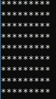
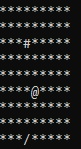
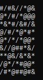

# Evolving-World
A simple world that evolves randomly over time

The world is first initialized with a 9x9 grid containing only * characters as shown below, 
 

With each iteration 3 randomly chosen elements on the grid are evolved to a new character among &, #, @ and /.
An example of the result after first iteration is show below.
The random elements to be evolved are chosen by using rand() function and taking modulo 9. 
The random new character the element evolves to is chosen by taking a modulo 4 from a rand() generated number.

 

What the World might look like at the end.
 
